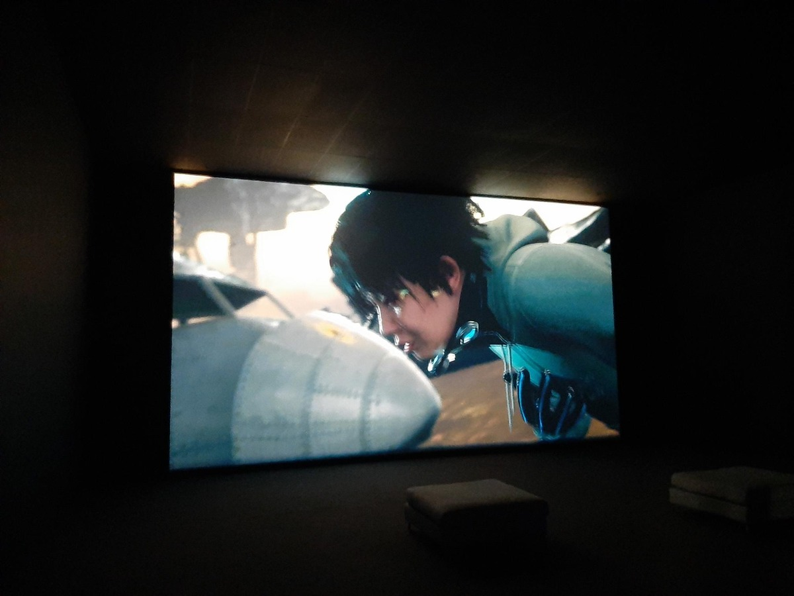
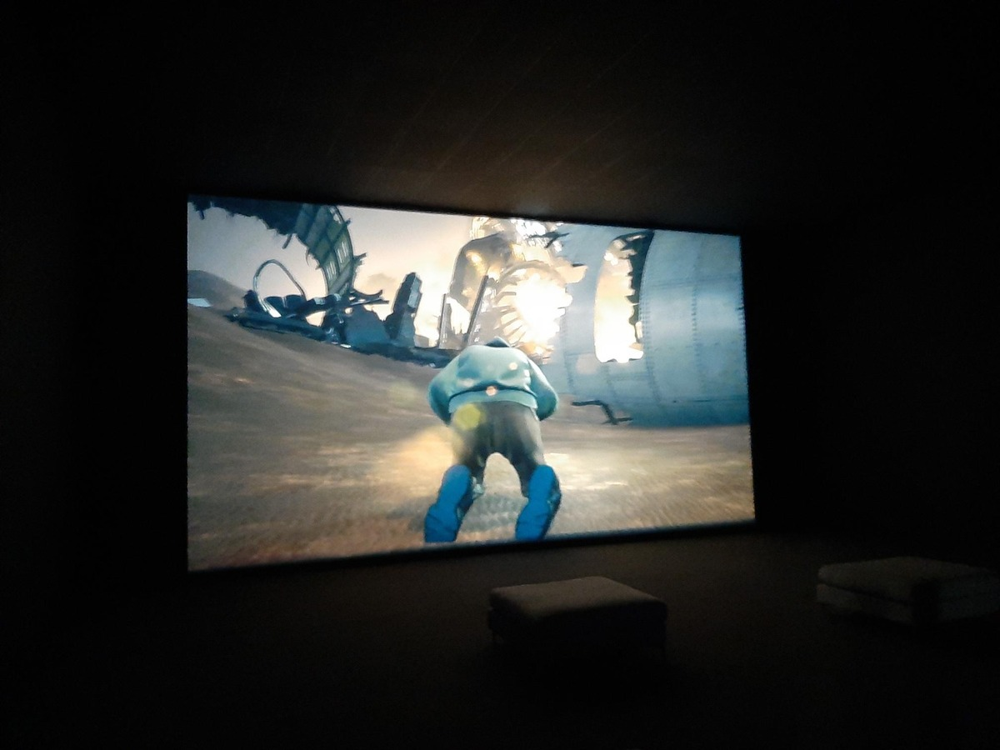
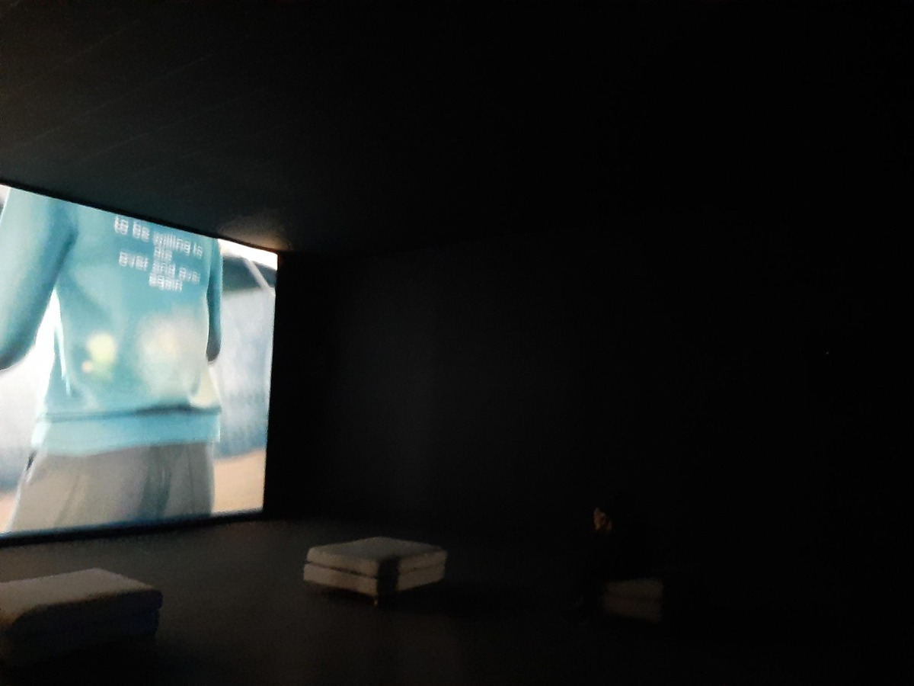
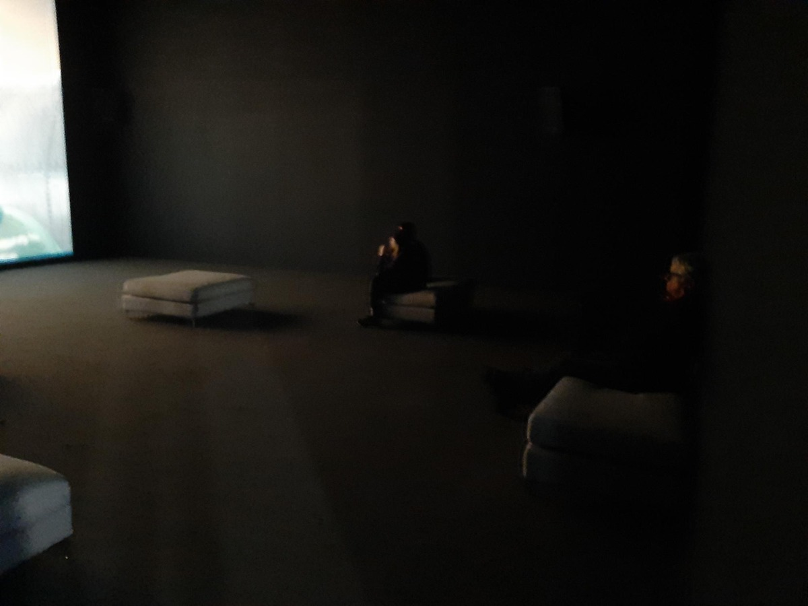

## Exposition BIAN
# LU YANG
Lieu de mise en exposition: Arsenal Art Contemporain

Type d'exposition: Intérieure

Date de votre visite: 03-02-2023

Titre de l'oeuvre: Doku The Self

Nom de l'artiste: LU YANG

Année de réalisation: 2020

Description de l'oeuvre: Incorporant la réalité virtuelle, les sous-cultures du jeu et la musique populaire, LuYang crée des expériences follement originales et provocantes qui célèbrent Internet et son offre de contrôle sur son identité, partiellement libérée des limites rigides de la nationalité, du genre et de la sexualité. Les projets multimédias immersifs relient le domaine numérique et l'espace physique d'une manière qui remet en question de manière significative les limites perceptuelles des distinctions en ligne et hors ligne. L'artiste refuse vocalement d'attribuer une signification politique à son travail, critiquant la fétichisation et la politisation de l'art chinois contemporain avec le même défi coloré typique des estampes, peintures, sculptures, vidéos et espaces dynamiques qu'ils créent. Caractérisé par le potentiel apparemment illimité de l'imagination frénétique et expansive de l'artiste, le travail de Lu est aussi saturé d'influences de manga et d'anime qu'il l'est de religion, de neurologie et du corps humain. 

Type d'installation (contemplative, immersive, interactive): Contemplative

Mise en espace:	 
                   
                    
                     

Composantes et techniques:	Une pièce isolée avec un grand écran et des haut-parleurs surround pour capturer complètement une expérience immersive.

Éléments nécessaires à la mise en exposition:	L'écran et des bancs

Expérience vécue: .

Ce qui vous a plu, vous a donné des idées: 
Vraiment intéressé par les mouvements très différents des personnages inclus dans la vidéo, bien que ce soit comme un jeu vidéo, ils ressemblaient à des humains.

🤔 Aspect que vous ne souhaiteriez pas retenir pour vos propres créations ou que vous feriez autrement:
Rien à redire, mais je dois dire que c'est la durée des clips et des personnages qui semblait un peu bizarre lors de la première vue.
