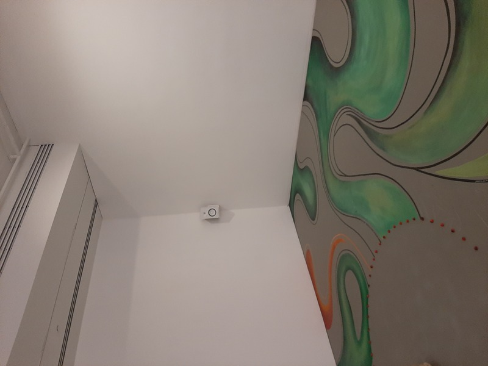
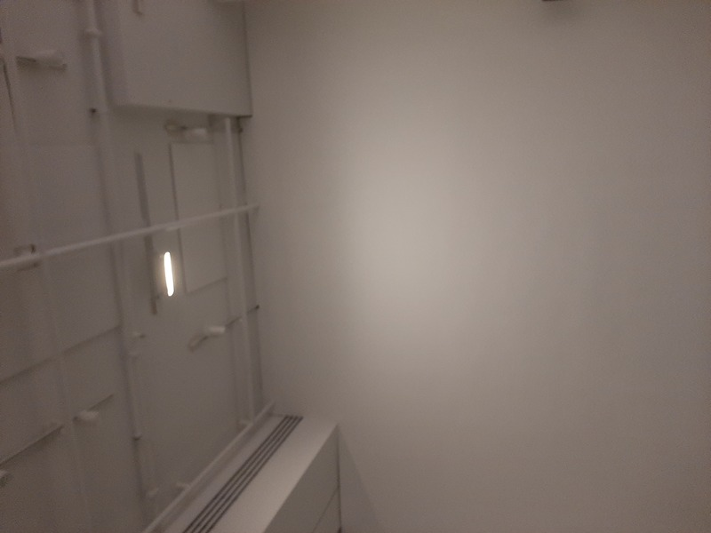

## Exposition de LA BANQUE D'INSPIRATIONS

Nom de l'exposition:
# Eshi uapatakau ishkueuatsh tshitassinu / Regards de femmes sur le territoire

### Lieu de mise en exposition:
Galerie de l'UQAM

### Type d'exposition:
Temporaire et intérieure

### Date de votre visite: 
08-03-2023

### Titre de l'oeuvre: # Takuneu, porter la vie

### Nom de l'artiste: Sophie Kurtness

### Année de réalisation: 2022

### Description de l'oeuvre Cartel:

"Avec, Takuneu, porter la vie, Sophie fait une mise a nue, évoqaunt le Terre généreuse qui nous porte toutes, nous nourrit, nous abrite at donne sans compter. Au centre de son oeuvre, on retrouve des pierrres en suspension au nombre de quatre qui sombolisent ses quatre enfants qu'elle a portés. Pour elle, le territoire est vivant, il noues supporte, il est le lieu de pratiques culturelles, identitaires, un lieu de connexion avec ce qui est en nous et ce qui est plus grand que soi. Elle s'y sent en sécurité, à l'abri. De ce fait, elle se doit de sensibiliser les autres à sa beauté, afin de le protéger."
(Paragraphe tiré directement de la description de Takenue, porter la vie)

### Type d'installation: 
Immersive

###Mise en espace Vue d'ensemble de la pièce:
                
                  
                    
                      

### Composantes et techniques: 
 Mise en place de plusieurs haut-parleurs dans les coins de la pièce et d'un mini projecteur au milieu avec des rochers suspendus au plafond.

###Éléments nécessaires à la mise en exposition:
                       
                        
                         
Haut-parleurs de salle, un petit projecteur au milieu, des cordes fines et des rochers.
               
### Expérience vécue :
 Quand je suis entré dans la petite pièce, j'ai été présenté par des sons enchanteurs faisant vibrer l'air. Il n'y avait pas grand-chose d'autre à faire que de se promener et de lire les planches du sol qui comprenaient des ruisseaux verts de terres dessinées portant de multiples noms d'artistes. La pièce donnait vraiment l'impression que j'étais sur un terrain spirituel.

### Ce qui vous a plu : L'expérience lucide qui donnait l'impression de se promener sur un terrain spirituel et la façon dont les noms / dessins étaient mis en œuvre sur le sol.

### Éléments pertinents : Le manque d'inclusion ou de contenu dans la salle.

Références hyperliens vers les sites consultés
