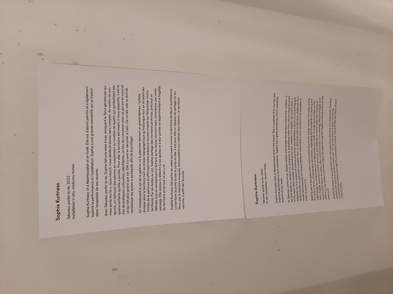
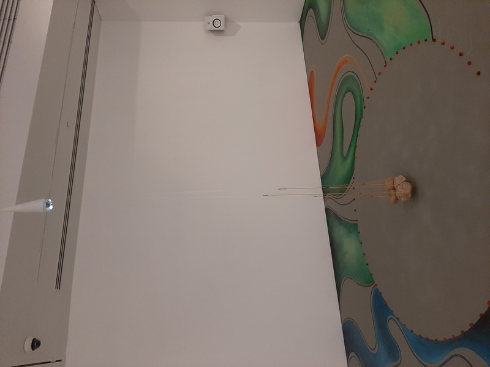
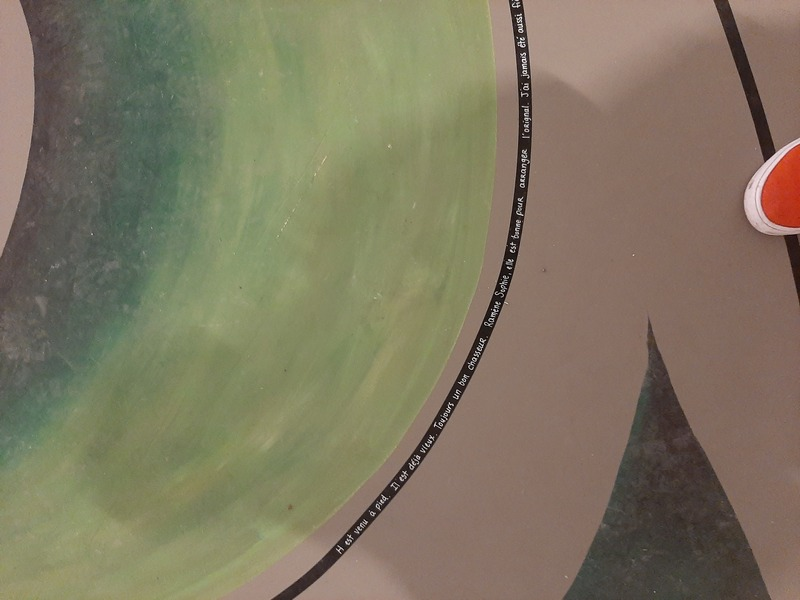
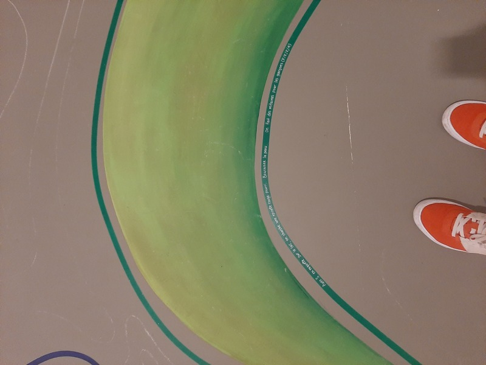

## Exposition de LA BANQUE D'INSPIRATIONS

Nom de l'exposition: #Eshi uapatakau ishkueuatsh tshitassinu / Regards de femmes sur le territoire

Lieu de mise en exposition: Galerie de l'UQAM

Type d'exposition (temporaire, permanente, itinérante, intérieure, extérieure): Temporaire et intérieure

Date de votre visite: 08-03-2023

Titre de l'oeuvre: # Takuneu, porter la vie

Nom de l'artiste: Sophie Kurtness

Année de réalisation: 2022

Description de l'oeuvre Cartel:
"Avec, Takuneu, porter la vie, Sophie fait une mise a nue, 

Type d'installation: Immersive

Mise en espace Vue d'ensemble de la pièce:
                     
                     
                      
                       
                      

Composantes et techniques: 

Éléments nécessaires à la mise en exposition:

Expérience vécue Posture du visiteur ou gestes de l'interacteur

❤️ Ce qui vous a plu

🤔 Éléments pertinents 

Références hyperliens vers les sites consultés
